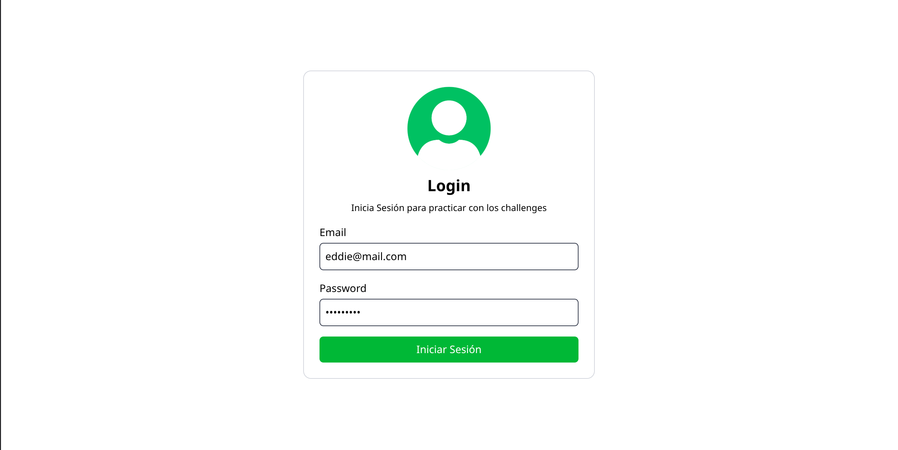
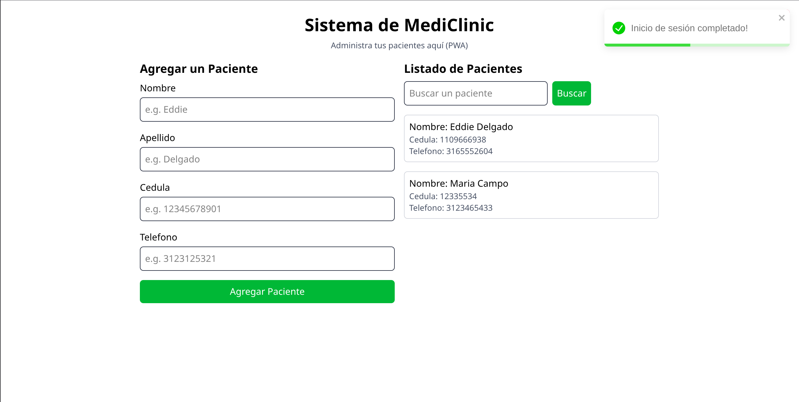
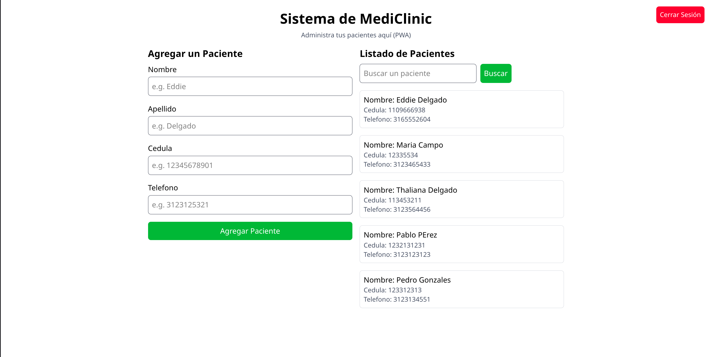
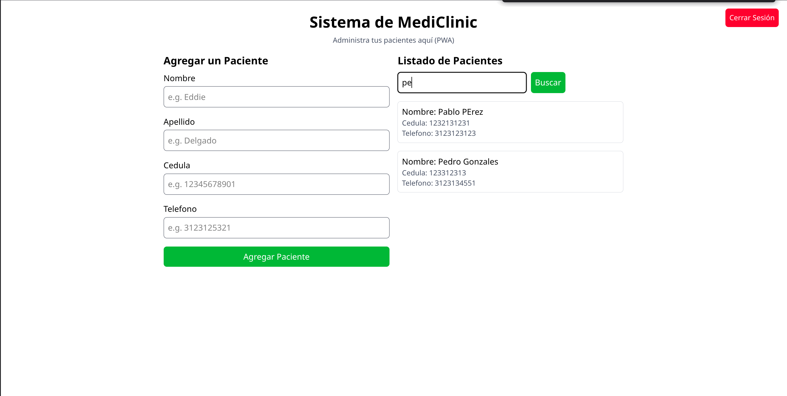
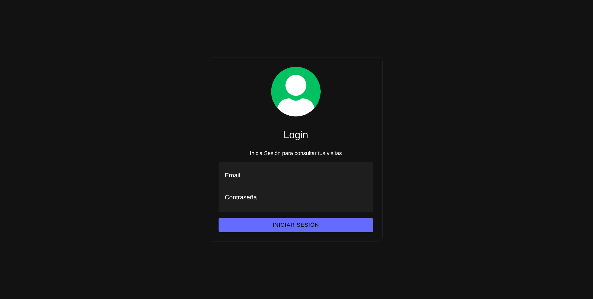
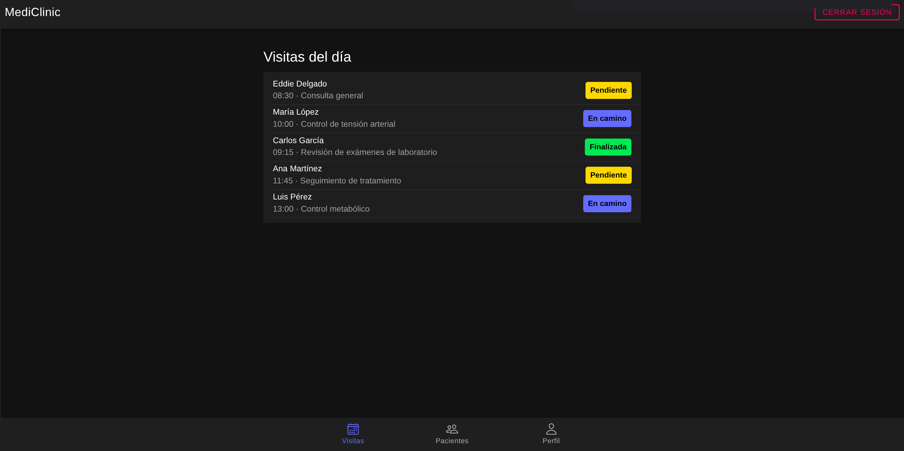
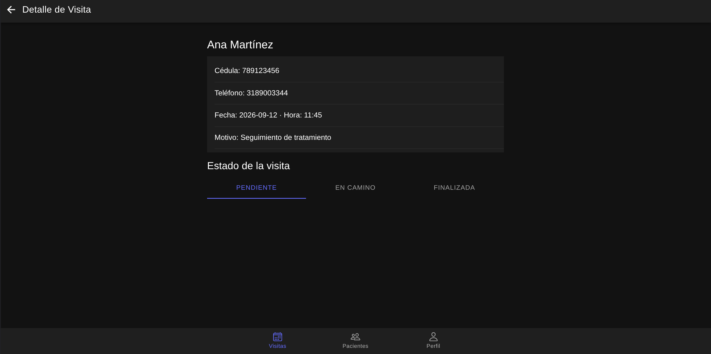
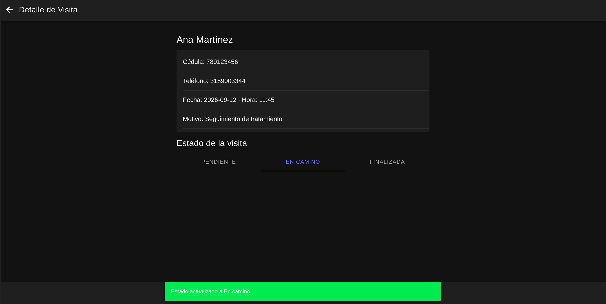
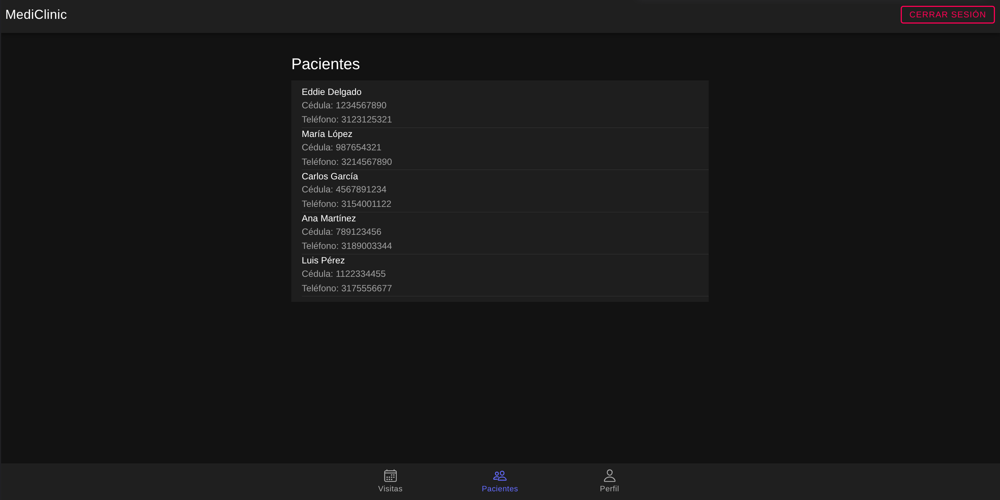
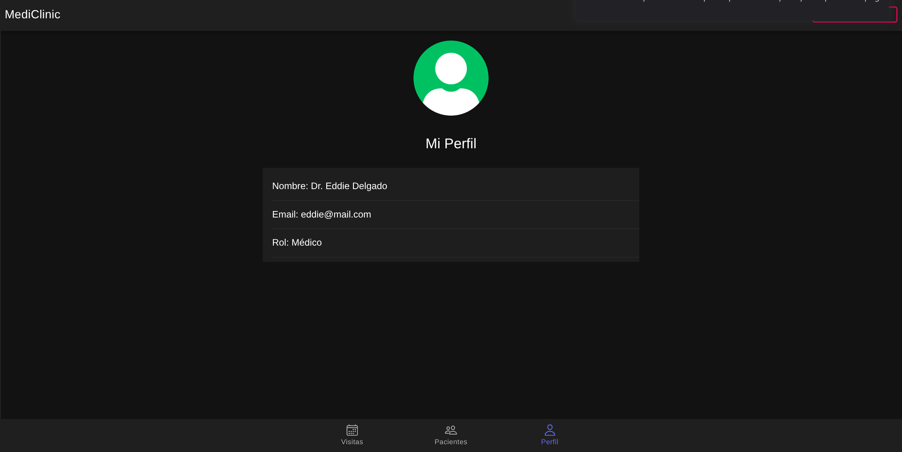

# PARCIAL 1 — Desarrollo de Plataformas Móviles

La clínica **MediClinic** necesita dos aplicaciones simples para gestionar pacientes y visitas médicas.

## Estructura del repositorio

| Carpeta             | Descripción                                                      |
| ------------------- | ---------------------------------------------------------------- |
| `pwa-react/`        | Aplicación web PWA en React para administración de pacientes.    |
| `ionic-mediclinic/` | Aplicación móvil en Ionic React con Tabs para consultar visitas. |
| `screenshots/`      | Capturas de pantalla de ambas aplicaciones funcionando.          |

> Toda la persistencia se realiza con `localStorage`. No se utiliza backend y las aplicaciones no comparten información entre ellas.

---

## 🖥️ PWA React — Administración de Pacientes

Aplicación web PWA construida con **React + Vite**, con soporte de _service worker_ para funcionar offline.

### Funcionalidades

- **Login**
  - Usuarios fijos proporcionados (e.g. `user@mail.com` / `123`).
  - Guarda la sesión en `localStorage` y la recupera al recargar.
  - Permite cerrar sesión.
  - Muestra un mensaje de error en pantalla con credenciales incorrectas (`react-toastify`).
- **Pacientes**
  - Listado de pacientes guardados en `localStorage`.
  - Formulario para agregar pacientes: nombre, apellido, CC y teléfono.
  - Validación de nombre, apellido y formato de CC.
- **Búsqueda**
  - Buscador por nombre, apellido o CC.
  - El estado del buscador vive en el componente padre y la lista filtrada se envía al componente hijo (En este caso no se implementa de esta manera puesto que se utiliza un contexto para que cualquier componente pueda acceder a estados y funciones globales)

### Capturas de pantalla — PWA

| Screenshot                                | Captura                                         |
| ----------------------------------------- | ----------------------------------------------- |
| Login                                     |          |
| Página principal con listado y formulario |            |
| Pacientes agregados                       |  |
| Filtrado de pacientes                     |    |

---

## 📱 Ionic React — Consulta de Visitas Médicas

Aplicación móvil construida con **Ionic + React**, usando `IonTabs` para la navegación después del login.

### Funcionalidades

- **Login**
  - Componentes de Ionic (`IonInput`, `IonButton`, `IonList`).
  - Muestra un `IonToast` cuando las credenciales son incorrectas.
  - Guarda la sesión en `localStorage`.
- **Navegación**
  - Después del login, `IonTabs` con tres pestañas: **Visitas**, **Pacientes** y **Perfil**.
- **Visitas**
  - Muestra las visitas del día (fechas generadas dinámicamente con la fecha actual).
  - Cada visita muestra paciente, hora y estado.
  - Al seleccionar una visita navega al detalle.
  - En el detalle se permite cambiar el estado: `pendiente → en_camino → finalizada`.
  - Los cambios se guardan en `localStorage`.

### Capturas de pantalla — Ionic

| Screenshot          | Captura                                             |
| ------------------- | --------------------------------------------------- |
| Login               |          |
| Página de Visitas   |      |
| Detalle de Visita   |      |
| Cambio de estado    |        |
| Página de Pacientes |  |
| Página de Perfil    |        |

---

## 🚀 Ejecución

Cada aplicación se ejecuta de forma independiente:

```bash
# PWA React
cd pwa-react
npm install
npm run dev

# Ionic React
cd ionic-mediclinic
npm install
ionic serve
```

## 🔑 Credenciales de prueba

| Email            | Contraseña  |
| ---------------- | ----------- |
| `user@mail.com`  | `123`       |
| `eddie@mail.com` | `eddie2007` |
| `maria@mail.com` | `maria123`  |
